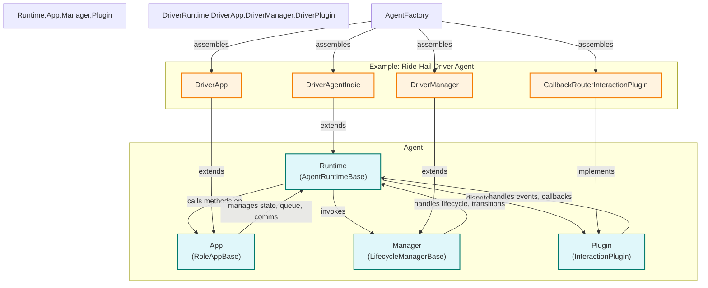
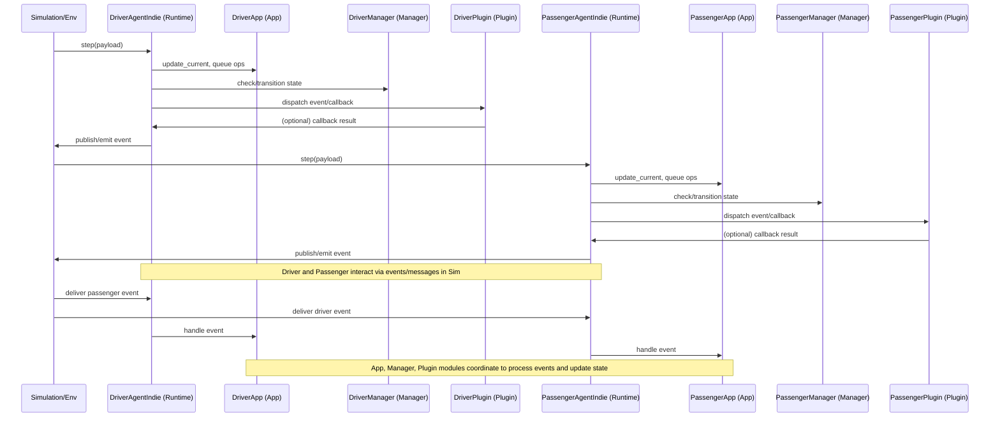

# agent_core Design Overview

The `agent_core` module provides a set of generic, composable building blocks for agent-based systems. Its design is intentionally decoupled from any specific domain, but is powerful enough to support complex scenarios like ride_hail.

## Core Roles

- **Runtime (`AgentRuntimeBase`)**
  The runtime is the agent’s main loop and lifecycle manager. It processes incoming payloads (e.g., simulation steps, events), coordinates the agent’s state transitions, and invokes the app, manager, and plugins as needed.
  In ride_hail, `DriverAgentIndie` extends the runtime to implement driver-specific logic for entering/exiting the market, handling steps, and error management.

- **App (`RoleAppBase`)**
  The app encapsulates the agent’s application-level state and message queue. It manages communication with the environment (e.g., simulation, backend services), tracks the latest simulation clock and location, and provides helpers for message handling.
  In ride_hail, `DriverApp` manages the driver’s credentials, user registry, and composes the driver’s manager and trip manager.

- **Manager (`LifecycleManagerBase`)**
  The manager handles the agent’s lifecycle and state transitions, often interfacing with backend APIs or state machines. It provides helpers for moving between workflow states and managing persistent records.
  In ride_hail, `DriverManager` manages the driver’s profile, vehicle, and state transitions (e.g., login, logout, registration).

- **Plugin (`InteractionPlugin` / `CallbackRouterInteractionPlugin`)**
  The plugin system enables flexible, decoupled handling of agent interactions (messages, state changes, events). Plugins can register callbacks for specific actions or states, and the runtime dispatches to them as needed.
  In ride_hail, the plugin is used to handle driver/passenger workflow events, such as trip assignments, confirmations, and state transitions.

- **Extensibility (`extra_components`)**
  Agent-specific dependencies (such as trip managers, custom analytics, or adapters) can be injected via `extra_components` in the factory. This keeps agent_core generic, while allowing rich, domain-specific wiring in your application.

## Example: Ride-Hail Driver Agent

- **Runtime:** `DriverAgentIndie` (extends `AgentRuntimeBase`)
- **App:** `DriverApp` (extends `RoleAppBase`)
- **Manager:** `DriverManager` (extends `LifecycleManagerBase`)
- **Trip Manager:** `DriverTripManager` (extends `RoleTripManagerBase`, injected via `extra_components`)
- **Plugin:** `CallbackRouterInteractionPlugin` (implements `InteractionPlugin`)

The agent is assembled using AgentFactory, which wires these components together. The runtime coordinates the agent’s lifecycle, the app manages state and communication, the manager handles workflow transitions, the trip manager manages trip-specific logic, and the plugin handles event-driven interactions.

This modular design allows you to:
- Swap out or extend any component for new agent types.
- Inject additional dependencies as needed.
- Reuse agent_core in any agent-based domain, not just ride_hail.

## agent_core Design Flowchart



## agent_core Control Flow: Driver & Passenger Interaction

The following sequence diagram illustrates how control flows between the simulation, driver agent, and passenger agent, and how the agent_core modules participate in a typical interaction:



### Explanation
- **Simulation/Env** triggers each agent’s step by sending a payload to the agent’s Runtime.
- **Runtime** (DriverAgentIndie/PassengerAgentIndie) coordinates the step, updating the App, invoking the Manager for state transitions, and dispatching events to the Plugin.
- **App** manages agent state, message queue, and communication with the environment.
- **Manager** handles workflow and lifecycle transitions, often involving backend or state machine logic.
- **Plugin** processes event-driven callbacks, enabling flexible and decoupled event handling.
- After processing, the Runtime may publish or emit events back to the Simulation.
- The Simulation routes events/messages between agents (e.g., driver and passenger), delivering them as new payloads to the respective agent Runtimes.
- The App, Manager, and Plugin modules work together to process these events and update agent state, enabling rich, modular, and testable agent interactions.

## Declarative Callback Registration

agent_core now supports registering message and state callbacks using decorators, making agent logic more declarative and discoverable.

### Usage Example

```python
from agent_core.interaction.decorators import message_handler, state_handler
from agent_core.interaction.plugin import CallbackRouterInteractionPlugin

class MyHandlers:
    @message_handler("driver_workflow_event", "driver_confirmed_trip")
    def handle_driver_confirmed_trip(self, payload, data, **kwargs):
        # handle event
        pass

    @state_handler("driver_waiting_to_pickup")
    def handle_waiting_to_pickup(self, **kwargs):
        # handle state
        pass

handlers = MyHandlers()
plugin = CallbackRouterInteractionPlugin(handler_obj=handlers)
```

- Use `@message_handler(action, event)` to mark a method as a message handler.
- Use `@state_handler(state)` to mark a method as a state handler.
- Pass the handler object to `CallbackRouterInteractionPlugin(handler_obj=...)` to auto-register all decorated methods.
- You can still use `register_message` and `register_state` for imperative registration if needed.
