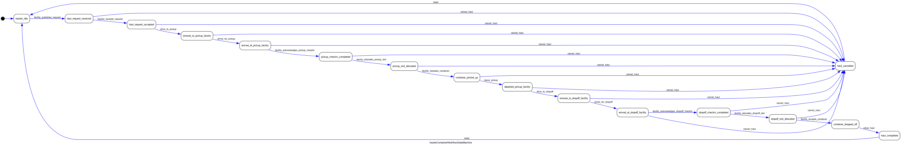
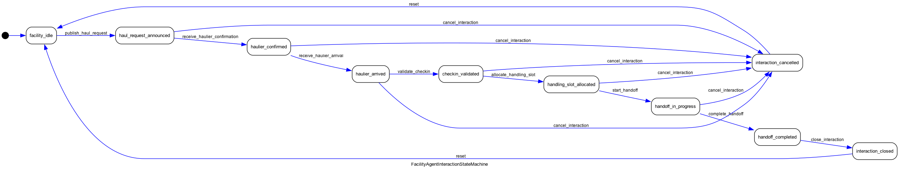

# Container Logistics State Machines

This folder defines event-driven state machines for container logistics interactions.

## Scope
- Focuses on interaction events between agents.
- Does not model internal facility operations.

## Agents
- Haulier: container truck/driver workflow.
- Port agent: pickup or dropoff facility role.
- Depot agent: pickup or dropoff facility role.
- Warehouse agent: pickup or dropoff facility role.

## State Machine Graphs

### Haulier Workflow

### Facility Agent Workflow

## Event Mapping (Interaction-Centric)
| Step | Haulier Event (Trigger) | Facility Event (Trigger) | Typical Actor |
|---|---|---|---|
| 1 | `facility_publishes_request` | `publish_haul_request` | Port/Depot/Warehouse |
| 2 | `haulier_accepts_request` | `receive_haulier_confirmation` | Haulier |
| 3 | `arrive_for_pickup` | `receive_haulier_arrival` | Haulier |
| 4 | `facility_acknowledges_pickup_checkin` | `validate_checkin` | Facility |
| 5 | `facility_allocates_pickup_slot` | `allocate_handling_slot` | Facility |
| 6 | `facility_releases_container` | `start_handoff` -> `complete_handoff` | Facility + Haulier |
| 7 | `leave_pickup` | `close_interaction` | Haulier + Facility |
| 8 | `arrive_for_dropoff` | `receive_haulier_arrival` | Haulier |
| 9 | `facility_acknowledges_dropoff_checkin` | `validate_checkin` | Facility |
| 10 | `facility_allocates_dropoff_slot` | `allocate_handling_slot` | Facility |
| 11 | `facility_accepts_container` | `start_handoff` -> `complete_handoff` | Facility + Haulier |
| 12 | `close_haul` | `close_interaction` | Haulier + Facility |

## Cancellation
- Haulier side: `cancel_haul`
- Facility side: `cancel_interaction`

## Implemented Classes
- `HaulierContainerWorkflowStateMachine`
- `FacilityAgentInteractionStateMachine`
- `PortAgentInteractionStateMachine`
- `DepotAgentInteractionStateMachine`
- `WarehouseAgentInteractionStateMachine`
