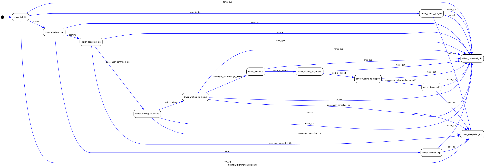
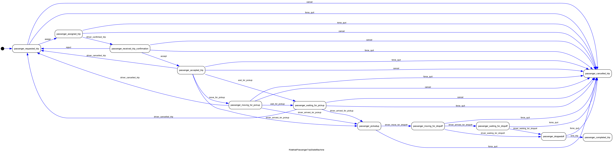

# Ride Hail State Machines

This folder defines event-driven state machines for driver and passenger trip workflows.

## Scope
- Focuses on interaction events between driver and passenger.
- Does not model internal platform allocation logic.

## State Machine Graphs

### Driver Trip

### Passenger Trip

## Event Mapping (Interaction-Centric)
| Step | Driver Event (Trigger) | Passenger Event (Trigger) | Typical Actor |
|---|---|---|---|
| 1 | `recieve` | `assign` | Platform |
| 2 | `confirm` | `driver_confirmed_trip` | Driver + Passenger |
| 3 | `passenger_confirmed_trip` | `accept` | Passenger |
| 4 | `wait_to_pickup` | `wait_for_pickup` | Driver + Passenger |
| 5 | `passenger_acknowledge_pickup` | `driver_arrived_for_pickup` | Driver |
| 6 | `move_to_dropoff` | `driver_move_for_dropoff` | Driver |
| 7 | `wait_to_dropoff` | `driver_arrived_for_dropoff` | Driver |
| 8 | `passenger_acknowledge_dropoff` | `driver_waiting_for_dropoff` | Passenger + Driver |
| 9 | `end_trip` | `end_trip` | Driver + Passenger |

## Cancellation and Exit
- Passenger-initiated cancellation impacts driver via `passenger_cancelled_trip`.
- Driver-initiated cancellation impacts passenger via `driver_cancelled_trip`.
- Local exits: `cancel`, `force_quit`.

## Implemented Classes
- `RidehailDriverTripStateMachine`
- `RidehailPassengerTripStateMachine`
