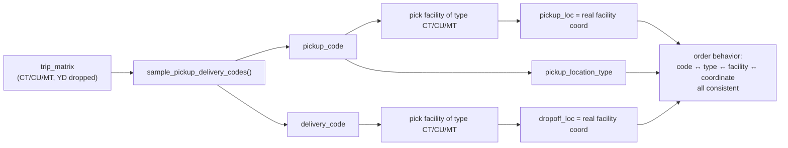
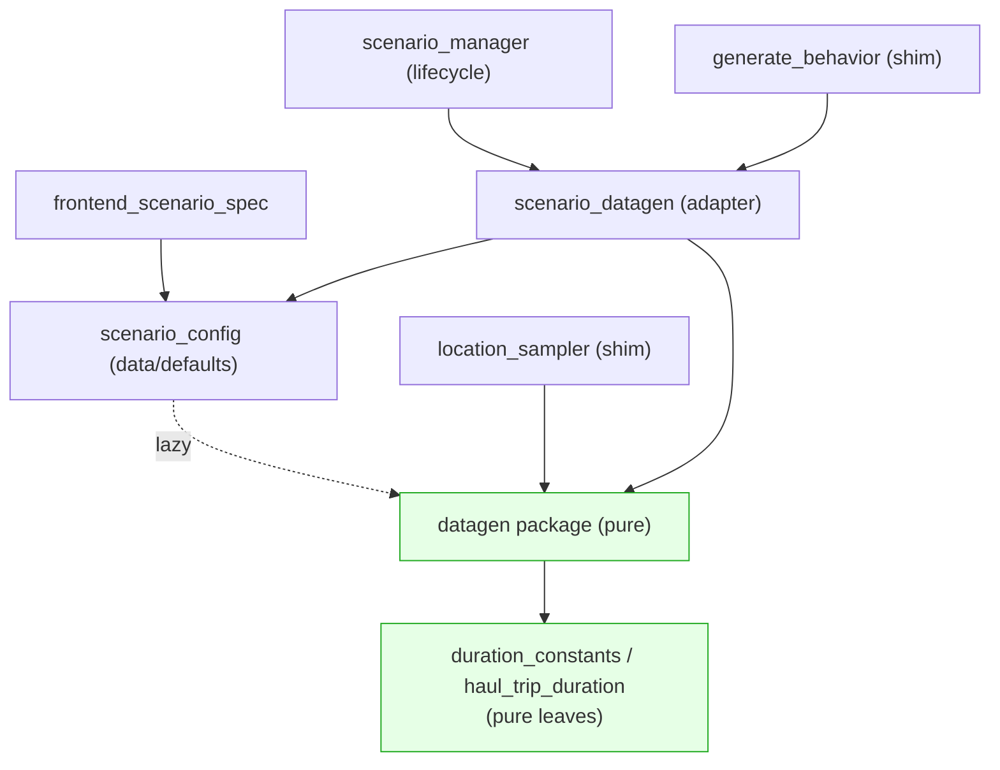

# Container-logistics data generation — end-to-end flow

> Preview in VS Code with the **Markdown Preview Mermaid Support** extension
> (`bierner.markdown-mermaid`), or paste into https://mermaid.live.

## Pipeline overview

```mermaid
flowchart TD
    subgraph TRIGGER["1 · Trigger"]
        FE["Frontend scenario editor<br/>writes scenario_meta.json<br/>(source: frontend)"]
        DEF["Default / built-in run<br/>(scenario_config defaults)"]
    end

    FE --> LOG
    DEF --> LOG

    subgraph MGR["2 · ScenarioManager (lifecycle owner)"]
        LOG["load_or_generate_behaviors()"]
        DEC{"6 files exist<br/>and match spec?"}
        OVR["apply frontend/smoke override<br/>(temporarily patches scenario_config)"]
        ORS["build orsim_settings<br/>(smoke / long-run / preserve)"]
        LOG --> DEC
        DEC -- yes --> LOAD["load 6 JSON files → done"]
        DEC -- no --> OVR --> ORS
    end

    ORS --> ADP

    subgraph BND["3 · Adapter — the ONLY boundary"]
        ADP["build_generation_spec(domain, counts, ...)<br/>reads scenario_config ONCE"]
        SPEC["GenerationSpec (frozen)<br/>counts · calendar · role settings ·<br/>distributed hauliers · hourly_weights ·<br/>trip_matrix · csv + mask paths"]
        ADP --> SPEC
    end

    SPEC --> GEN

    subgraph DG["4 · datagen package (PURE — no globals, no scenario imports)"]
        GEN["ScenarioGenerator(spec).generate()"]
        subgraph SAMPLE["sample"]
            CAT["LocationCatalog<br/>real CT/CU/MT addresses<br/>facility_sites(n): CU-weighted alloc<br/>SingaporeMask (optional)"]
        end
        subgraph BUILD["build (schema-compatible dicts)"]
            TB["TruckBuilder"]
            OB["OrderBuilder<br/>code→type→facility coherence"]
            FB["FacilityBuilder"]
            AB["AssignmentBuilder"]
            NB["AnalyticsBuilder"]
        end
        GEN --> CAT --> BUILD
        BUILD --> RES["GenerationResult<br/>5 in-memory collections"]
    end

    RES --> POST

    subgraph PERSIST["5 · ScenarioManager (post-process + persist)"]
        POST["assign collections"]
        STG["_stagger_early_orders()<br/>(warm-up batch → sim hour 0)"]
        WR["write 6 JSON files +<br/>BEHAVIOR_REVISION / GENERATION_SPEC"]
        POST --> STG --> WR
    end

    WR --> FILES[("datahub/&lt;domain&gt;/dataset/&lt;scenario&gt;/<br/>truck · order · facility ·<br/>assignment · analytics · orsim_settings")]
    LOAD --> FILES
    FILES --> SIM["6 · Sim loads behaviors → runs<br/>(facility resolved by profile.name → Mongo)"]
```

## OrderBuilder coherence (the per-leg fix)

## Module dependency direction (isolation)

